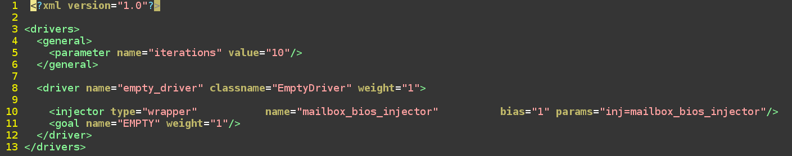

Volume Validation Post Processing framework
=======================================================

 
### What is Kiwi?


Kiwi is a random test generator for generating tests for the Foxcode TE. 

Kiwi takes a bias file as input, and creates a ruby file that can then be run by the Foxcode TE. 

The main goals of Kiwi is to enable volume testing of P-code and to provide the ability to test cross product features.


The kiwi bias file contains goals, drivers, and injectors. 

Kiwi's main job is coordination between the drivers and injectors. It does not inherently know the relationships between drivers and injectors. 

Kiwi's drivers create a serial code stream, while the injectors setup code that runs in parallel to the drivers. 

Each iteration of the main loop will pick one driver/goal combination from the bias file, and a handful of injectors. At the end of the driver code block, all of the injectors currently running will be killed to allow the next driver section a clean slate to start from.

More details of bias file can be found [here](https://wiki.ith.intel.com/pages/viewpage.action?pageId=2836772655#Kiwi-Biasfiles)


Know more about kiwi framework here : 

Post Processing for mailbox
=======================================================


Mailboxes communicate data to various IP's across the socket.
It is essential to check the responses(error and data) obtained during communication.
Volume validation helps in testing this mailbox communication at scale.   

Post processing framework helps to verify the responses obtained from P-code against requirements of mailbox specification.

Kiwi framework is used to generate testcase while injecting random command of the respective mailbox with data, interface values while also generating response for the same.
Response consists of data and error.

The kiwi logs are parsed from the fox2run.log files from regressions folder
These kiwi logs(commands and it's response) are populated into trace XML(mailbox_fuzzing_log.XML) which will be stored in regressions folder.

The final trace_out file with test result for each command is also stored in the regressions folder

## How mailbox post-processing framework works?


This is a python based framework which is used to evaluate the error codes of mailbox.

1. The mailbox specification XML is parsed completely and created into dictionary.
   This spec dictionary contains details of each command and subcommands (lsb, numbits) information of each command. 

2. The interface and data values from trace XML is written into the lsb,
   numbits position of the respective command obtained from spec dictionary.
   This trace dictionary contains data values of subcommands, cpl phases,
   opcodes of respective commands

3. The error codes emitted by primecode for each command is evaluated with
   logic as per mailbox specification document.
   The logic for each error code of a specific command is understood with the
   help of mailbox specification document.
  
   Attributes required for building logic of error code is polled from spec
   dictionary and trace dictionary

4. The error code logic is evaluated and the result is compared with error
   codes emitted by primecode.
   If both the error codes is matched the test result is updated as "pass"
   else test result is updated as "fail".


### How to implement :-
 
**STEP 1:** Create bias file (XML):

Feature xml is a kiwi input file, kiwi uses this feature XML file to generate
randomized test cases in scale. 

example of feature xml for bios.


Injector of specific feature which is defined in test interface is called in the feature xml.
kiwi uses this injector to generate ruby testcase files.

The feature xml created is stored in the below folder location of validation
repository
```sh
firmware.management.primecode.validation/verif/tests/fox2/kiwi/bias/feature_xml/
```

**STEP 2:** Generate ruby testcases and Fuzzing log files

It is suggested to keep the regressions folder empty before executing the below command.

Using the above feature xml, kiwi generates ruby testcase files for 'n' seeds and generates intermediate files for each seed.

The below command runs 100 seeds for bios feature, i.e. 100 ruby test files are generated
```sh
scripts/mailbox_fuzz.sh 100 "./scripts/run_feature_xml.sh $MODEL_ROOT/verif/tests/fox2/kiwi/bias/feature_xml/bios.xml"
```

After the fox2run.log files are generated, script parses all the fox2run.log files and populates the trace file (i.e. mailbox_fuzzing_log.xml) with command, interface, data values and it's corresponding response data and error.


Python based post-processing framework generates consolidated output with the help of specification xml (obtained from firmware repository), trace xml(populated by kiwi) and error code xml.

The final test reults (pass/fail) is updated for each command in trace_out.xml file which can be found in the regressions folder itself.


Important files to look for in regressions folder after running the above
command:

1. mailbox_fuzzing_log.xml - trace xml obtained after populating data, interface response information of all commands by parsing fox2run.log files

2. trace_out.xml - uptaded trace xml with final test results (pass/fail)

3. summary.txt - contains detailed summary of total number of crashes, passed and failed commands.


### What happens when crash is encountered?

Crashes are identified in with the help of MCA (Machine Check Abort) emitting various codes for different types of crashes

Thus, when a crash is encountered, the post processing framework recognizes the occurence of crash from the fox2run.log and updates the trace file with "<crash_log>" tag with description for that specific command.
